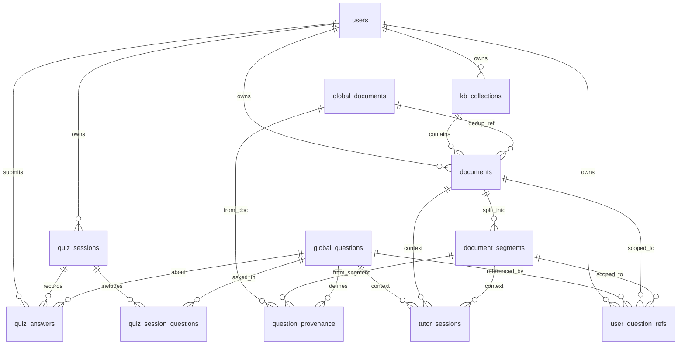

# 知拾数据库设计（PLAN 对齐版）

> 作者：王晨 · fork 本地默认 SQLite，团队环境可切换 MySQL  
> 同一套 SQLAlchemy models + Alembic migration，仅 `DATABASE_URL` 不同。

---

## 0. 存储与异步说明

| 组件 | 方案 | 说明 |
|------|------|------|
| 业务数据库 | **SQLite**（本地）/ MySQL（团队） | 使用 **同步** SQLAlchemy `Session`，与 FastAPI 路由兼容 |
| 会话 / Token | Redis 或 `CACHE_BACKEND=memory` | 与 DB 引擎无关 |
| 向量检索 | Dify | 不在 SQLite 做全文/向量 |
| LLM / Agent | Tina `predict` / `apredict` | 异步在网络 I/O 层，不依赖 DB 异步 |

SQLite 若未来要上 `AsyncSession`，需 `aiosqlite` 且仍受「单写锁」限制；**当前项目无需 async ORM**。

本地配置示例：

```env
DATABASE_URL=sqlite:///./data/zhishi.db
```

---

## 1. 设计原则

1. **用户隔离**：所有用户资源表带 `user_id`，查询必须过滤。
2. **全局去重**（PLAN §2.4）：文件、题目各一张全局表，`content_hash` 唯一。
3. **学习区才出题**：`zone = study` 的文档才触发分段与出题；`life` 仅 Dify 检索。
4. **引用可定位**（PLAN §3.2）：题目、辅导、聊天 citation 均指向 `document_segments`。
5. **兼容现有**：保留 `users`、`plan_tiers`；`users.dataset_id` 仍为默认 Dify 知识库。
6. **替代 JSON 文件**：`upload_hashes.json` 由 `documents` + `global_documents` 取代。

---

## 2. ER 关系概览



---

## 3. 已有表（保留，微调）

### 3.1 `users`

现有字段不变。`dataset_id` = 注册时创建的 **默认 Dify 知识库**。

| 字段 | 类型 | 说明 |
|------|------|------|
| id | INTEGER PK | |
| email | VARCHAR(255) UNIQUE | |
| … | | 见 `app/models/models.py` |
| dataset_id | VARCHAR(255) NULL | 默认 Dify dataset |

### 3.2 `plan_tiers`

现有字段不变。

---

## 4. 知识库与文档

### 4.1 `kb_collections` — 知识库分区（PLAN §2.1、§3.1）

用户可创建多个「知识库/分类」，对话与刷题时可选择。

| 字段 | 类型 | 约束 | 说明 |
|------|------|------|------|
| id | VARCHAR(36) PK | UUID | |
| user_id | INTEGER FK → users.id | NOT NULL, INDEX | |
| name | VARCHAR(100) | NOT NULL | 如「高等数学」 |
| zone | VARCHAR(20) | NOT NULL | `study` \| `life` |
| description | VARCHAR(500) | NULL | |
| dataset_id | VARCHAR(255) | NULL | 为空则用 `users.dataset_id` |
| is_default | BOOLEAN | DEFAULT 0 | 每用户最多一个 default |
| created_at | DATETIME | | |
| updated_at | DATETIME | | |

**索引**：`(user_id, zone)`，`UNIQUE(user_id, name)`（可选）

**规则**：

- `zone=life`：文档可上传，**不**分段、**不**自动生成题。
- `zone=study`：上传后异步/同步执行分段 + 出题。

---

### 4.2 `global_documents` — 全局文件实体（PLAN §2.4）

相同文件内容全局只存一份。

| 字段 | 类型 | 约束 | 说明 |
|------|------|------|------|
| id | VARCHAR(36) PK | UUID | |
| content_hash | VARCHAR(64) | UNIQUE, NOT NULL | SHA256(hex) |
| original_filename | VARCHAR(255) | NOT NULL | |
| mime_type | VARCHAR(100) | NULL | |
| file_size | INTEGER | NOT NULL | bytes |
| storage_path | VARCHAR(512) | NOT NULL | 全局存储路径 |
| parsed_text_path | VARCHAR(512) | NULL | 解析后纯文本路径 |
| created_at | DATETIME | | 首次上传时间 |

---

### 4.3 `documents` — 用户文档引用

替代 `upload_hashes.json` + 补全元数据。

| 字段 | 类型 | 约束 | 说明 |
|------|------|------|------|
| id | VARCHAR(36) PK | UUID | 业务主键 |
| user_id | INTEGER FK | NOT NULL, INDEX | |
| collection_id | VARCHAR(36) FK → kb_collections.id | NOT NULL | 所属分区 |
| global_document_id | VARCHAR(36) FK | NULL | 命中全局去重时填写 |
| dify_document_id | VARCHAR(255) | NULL, INDEX | Dify 文档 ID |
| dify_batch_id | VARCHAR(255) | NULL | 索引进度查询 |
| display_name | VARCHAR(255) | NOT NULL | 展示文件名 |
| zone | VARCHAR(20) | NOT NULL | 冗余自 collection，便于查询 |
| tags | TEXT | NULL | JSON 数组字符串 `["标签"]` |
| content_hash | VARCHAR(64) | NOT NULL | 本次上传文件 hash |
| parsed_cache_key | VARCHAR(255) | NULL | `storage/{user}/parsed/...` |
| indexing_status | VARCHAR(20) | DEFAULT `pending` | pending / processing / completed / failed |
| segment_status | VARCHAR(20) | DEFAULT `not_started` | 分段任务状态 |
| question_gen_status | VARCHAR(20) | DEFAULT `not_started` | 出题任务状态 |
| created_at | DATETIME | | |
| updated_at | DATETIME | | |

**索引**：

- `UNIQUE(user_id, content_hash)` — 同一用户不重复上传同一文件
- `(user_id, collection_id)`
- `(global_document_id)`

**去重逻辑**：

1. 算 `content_hash`
2. 查 `global_documents`：有则复用 `storage_path`，只新建 `documents` 行
3. 无则写全局文件 + `global_documents` + `documents`

---

### 4.4 `document_segments` — 章节/分段（PLAN §1.3、§1.5、§3.2）

| 字段 | 类型 | 约束 | 说明 |
|------|------|------|------|
| id | VARCHAR(36) PK | UUID | |
| document_id | VARCHAR(36) FK | NOT NULL, INDEX | |
| order_index | INTEGER | NOT NULL | 从 0 递增 |
| title | VARCHAR(255) | NULL | 章节标题 |
| content | TEXT | NOT NULL | 分段正文 |
| char_start | INTEGER | NOT NULL | 在 parsed 全文中的起始偏移 |
| char_end | INTEGER | NOT NULL | 结束偏移（ citation 高亮） |
| created_at | DATETIME | | |

**索引**：`UNIQUE(document_id, order_index)`

**分段策略**（实现层，非 DB）：

- Markdown：`#` / `##` 标题切分
- 无标题：定长窗口（如 1500 字）+ overlap 200
- 仅 `zone=study` 文档写入

---

## 5. 题库

### 5.1 `global_questions` — 全局题目（PLAN §1.4、§2.4）

| 字段 | 类型 | 约束 | 说明 |
|------|------|------|------|
| id | VARCHAR(36) PK | UUID | |
| content_hash | VARCHAR(64) | UNIQUE, NOT NULL | 题干+选项规范化后的 hash |
| stem | TEXT | NOT NULL | 题干 |
| question_type | VARCHAR(20) | NOT NULL | single_choice / multiple / short_answer / true_false |
| options | TEXT | NULL | JSON：`[{"key":"A","text":"..."}]` |
| answer | TEXT | NOT NULL | 标准答案 |
| explanation | TEXT | NULL | 解析 |
| tags | TEXT | NULL | JSON 数组 |
| source_type | VARCHAR(20) | NOT NULL | extracted / generated / manual |
| difficulty | INTEGER | NULL | 1–5，可选 |
| created_at | DATETIME | | |

---

### 5.2 `question_provenance` — 题目来源（多对多溯源）

一题可关联文档/分段；一分段可产多题。

| 字段 | 类型 | 约束 | 说明 |
|------|------|------|------|
| id | VARCHAR(36) PK | UUID | |
| question_id | VARCHAR(36) FK → global_questions.id | NOT NULL, INDEX | |
| global_document_id | VARCHAR(36) FK | NULL | |
| document_id | VARCHAR(36) FK | NULL | 用户文档 |
| segment_id | VARCHAR(36) FK → document_segments.id | NULL | **辅导/错题原文定位** |
| excerpt | TEXT | NULL | 出题时截取的原文片段 |

**索引**：`(question_id)`，`(segment_id)`

---

### 5.3 `user_question_refs` — 用户题库引用（PLAN §1.3）

| 字段 | 类型 | 约束 | 说明 |
|------|------|------|------|
| id | VARCHAR(36) PK | UUID | |
| user_id | INTEGER FK | NOT NULL, INDEX | |
| question_id | VARCHAR(36) FK | NOT NULL | |
| document_id | VARCHAR(36) FK | NOT NULL | |
| segment_id | VARCHAR(36) FK | NULL | |
| collection_id | VARCHAR(36) FK | NULL | |
| added_at | DATETIME | | |

**索引**：`UNIQUE(user_id, question_id, document_id)` — 同一用户同一文档不重复引用同一题

---

## 6. 刷题（PLAN §1.1、§1.5、§1.6）

### 6.1 `quiz_sessions`

| 字段 | 类型 | 约束 | 说明 |
|------|------|------|------|
| id | VARCHAR(36) PK | UUID | |
| user_id | INTEGER FK | NOT NULL, INDEX | |
| collection_id | VARCHAR(36) FK | NULL | |
| document_id | VARCHAR(36) FK | NULL | 针对某资料刷题 |
| title | VARCHAR(200) | NULL | |
| status | VARCHAR(20) | DEFAULT `active` | active / completed |
| started_at | DATETIME | | |
| finished_at | DATETIME | NULL | |

---

### 6.2 `quiz_session_questions`

| 字段 | 类型 | 约束 | 说明 |
|------|------|------|------|
| session_id | VARCHAR(36) FK | PK(复合) | |
| question_id | VARCHAR(36) FK | PK(复合) | |
| order_index | INTEGER | NOT NULL | |

**索引**：`UNIQUE(session_id, order_index)`

---

### 6.3 `quiz_answers`

| 字段 | 类型 | 约束 | 说明 |
|------|------|------|------|
| id | VARCHAR(36) PK | UUID | |
| session_id | VARCHAR(36) FK | NOT NULL, INDEX | |
| question_id | VARCHAR(36) FK | NOT NULL | |
| user_id | INTEGER FK | NOT NULL | |
| user_answer | TEXT | NULL | 用户所选/所填 |
| status | VARCHAR(20) | NOT NULL | `correct` / `wrong` / `unknown` |
| answered_at | DATETIME | | |
| time_spent_seconds | INTEGER | NULL | |

**索引**：`UNIQUE(session_id, question_id)` — 每题一条最终记录（或允许多次 attempt 则去掉 UNIQUE，加 `attempt_no`）

**答错/unknown 响应**：JOIN `question_provenance` + `document_segments` 返回 `excerpt` / 全文。

---

## 7. 辅导（PLAN §1.5）

### 7.1 `tutor_sessions`

「我不会，和 Agent 聊聊」的上下文绑定。

| 字段 | 类型 | 约束 | 说明 |
|------|------|------|------|
| id | VARCHAR(36) PK | UUID | |
| user_id | INTEGER FK | NOT NULL, INDEX | |
| question_id | VARCHAR(36) FK | NOT NULL | |
| document_id | VARCHAR(36) FK | NOT NULL | |
| segment_id | VARCHAR(36) FK | NOT NULL | 绑定的章节内容 |
| quiz_answer_id | VARCHAR(36) FK | NULL | 关联触发本次辅导的答题 |
| chat_session_id | VARCHAR(64) | NULL | 复用 `/chat` 的 session_id（Redis/文件） |
| status | VARCHAR(20) | DEFAULT `active` | |
| created_at | DATETIME | | |
| updated_at | DATETIME | | |

Tina 对话历史仍走现有 Redis + 文件；DB 只存 **业务上下文**。

---

## 8. 聊天 citation（PLAN §3.2）

不单独建表，citation 为 **API 响应结构**，数据来源：

```json
{
  "doc_id": "documents.id",
  "segment_id": "document_segments.id",
  "title": "document_segments.title",
  "char_start": 1200,
  "char_end": 1450,
  "snippet": "..."
}
```

可选扩展表 `chat_citations`（若需持久化引用记录）— **v2 再做**。

---

## 9. 与现有模块的映射

| 现状 | 迁移后 |
|------|--------|
| `users.dataset_id` | 保留；`kb_collections.dataset_id` 可覆盖 |
| `upload_hashes.json` | 废弃 → `documents` + `global_documents` |
| Dify `document_id` | 存 `documents.dify_document_id` |
| `storage/{user}/parsed/` | 路径存 `parsed_cache_key` / `global_documents.parsed_text_path` |
| Redis chat 历史 | 不变 |
| LEKT | 独立；未来 `quiz_answers` 可喂 KT |

---

## 10. 默认数据

用户注册时除创建 Dify dataset 外，建议 seed：

```sql
-- 两个默认 collection
INSERT kb_collections (zone=study, name='学习区', is_default=1)
INSERT kb_collections (zone=life,  name='生活区', is_default=0)
```

---

## 11. 表清单汇总

| 表名 | 用途 | PLAN |
|------|------|------|
| users | 账号 | §4.1 |
| plan_tiers | 套餐 | 已有 |
| kb_collections | 知识库分区 / 对话选择 | §2.1, §3.1 |
| global_documents | 全局文件去重 | §2.4 |
| documents | 用户文档 | §1, §2 |
| document_segments | 章节分段 | §1.3, §1.5, §3.2 |
| global_questions | 全局题库 | §1.4, §2.3 |
| question_provenance | 题目溯源 | §1.3 |
| user_question_refs | 用户题库 | §1.3 |
| quiz_sessions | 刷题会话 | §1.1 |
| quiz_session_questions | 会话题序 | §1.1 |
| quiz_answers | 答题记录 | §1.5, §1.6 |
| tutor_sessions | 辅导上下文 | §1.5 |

**共新增 10 张表**（不含 users/plan_tiers）。

---

## 12. 下一步（实现顺序）

1. 在 `app/models/` 按上表写 SQLAlchemy models（UUID 用 `String(36)`）
2. Alembic `001_plan_schema.py`
3. `config.py` 默认 SQLite + `PRAGMA foreign_keys=ON`
4. 迁移 `kb.upload` 写入 `documents`，下线 `upload_hashes.json`
5. 实现 `segment_service` → `document_segments`
6. 实现 `question_gen_service` → `global_questions` + provenance + refs

---

## 13. SQLite 类型对照

| 逻辑类型 | SQLAlchemy | SQLite |
|----------|------------|--------|
| UUID | String(36) | TEXT |
| JSON | Text + app 校验 | TEXT |
| BOOLEAN | Boolean | INTEGER 0/1 |
| DATETIME | DateTime | TEXT ISO8601 |
| DECIMAL | Numeric(10,2) | NUMERIC |
