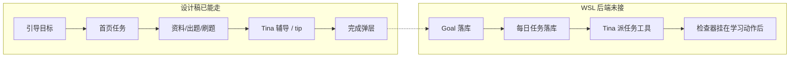

# 知序：闭环判断、设计方案与更新方案

更新日期：2026-08-20  
范围：`design/html/` 静态设计稿对照 **WSL 多用户服务端** `~/zhixu-backend`（FastAPI `:8765`，PostgreSQL，用户隔离）。  
Windows 仓库里的 `backend/src`（知拾本地引擎，约 `:7777`、无鉴权、`user_id` 常默认 1）**不是**本文对照对象，也不在这一轮更新范围内。

本文给产品/前后端共用：先说闭环有没有闭上，再说体验怎么定，最后说 WSL 后端怎么补。

---

## 1. 结论

**设计稿上的主路径已经能走完一圈，产品意义上的闭环还没有闭上。**

能走完的是学习动作：

引导确认目标 → 首页看到今日任务 → 上传 / 出题 / 按章刷 → 不会时右侧问 Tina → 划选收 tip → 回首页或今日状态看到任务被勾掉。

还没闭上的是「系统真的知道你要去哪、今天该做什么、做完没有」：

- 长期**目标**没有落库（`users` 只有昵称/性别/标签，没有 goal）
- 每日**任务**没有落库
- 完成靠设计稿里的 `localStorage` 假装；上传 / 出题 / 交卷接口不会返回「刚完成了哪几条任务」
- Tina 还不能根据目标和学情派任务，只能聊天、出题、辅导
- 现有引导是旧五步表单（渠道 / 上传 / 画像 / 标签 / 帮助），不是设计稿那套 Tina 对话确认目标
- 首页 `GET /dashboard/suggestions` 是按文档名让 LLM 写三条建议，不是按目标排的每日任务

所以：WSL 后端已经把「多用户 + 书和题」做扎实了；知序要把「目标 → 当天几件事 → 自动判定完成」接在这条学习引擎上面。不要另做一套日历，也不要把知拾侧栏里的扫描件解析搬进知序。

---

## 2. 知序要闭环的是什么

用户打开软件，只应感到三件事叠在一起：

| 层 | 是什么 | 不是什么 |
|---|---|---|
| **目标** | 长期方向，写得能被用上（科目、时间、对着哪本书） | 每天打勾的待办 |
| **学情** | 书、题、对/错/不会、tag、章节 | 用户自己申报「我会了」 |
| **任务** | 今天 1～3 件可跳转的动作，Tina 派，系统判完成 | 用户勾选；全路径预生成的 DAG |

闭环一句话：

**目标约束 Tina 派什么；学情决定派哪一件；用户去做学习动作；检查器看见结果就宣布完成。**

证据在刷题记录和资料里，不在用户侧的任务历史档案。任务可以在库里留几天做幂等和跨天滚动，界面上不要做成「任务博物馆」。

目标结束靠测量（题、tag）和结业测验，不是用户说「我学会了」。

---

## 3. 设计稿现在走到哪

`design/html/` 是知序的界面约定，不是知拾前端的像素拷贝。侧栏只有：首页、Tina、笔记、资料、进度、学习路径、设置（设置仍是占位）。

| 页面 | 已经演示的 | 还是假的 / 未接后端 |
|---|---|---|
| 引导 `onboarding.html` | 对话式：名字 → 身份 → 目标（太短再追问）→ 工具卡确认 → 上传或跳过 → 回首页 | 只写 `localStorage`（`zhixu-profile` / `zhixu-onboarding-done`） |
| 首页 `index.html` | 问候、目标卡、今日任务列表、完成态 | 任务目录写死在 `tasks.js`；「和 Tina 聊聊」应是问候下的一句话，不是单独卡片 |
| Tina `tina.html` | 平铺正文（AI 侧无头像）、历史可收、对话里嵌题、展示/制作 tip、划选 tip | 无真实会话、无派任务工具 |
| 资料 `quiz.html` / `quiz-doc.html` | 书架、书本详情、出题按钮、按章「刷这一章」筛选窗（未做 / 错 / 不会 / 做过） | 出题、目录、统计都是静态 |
| 刷题 `practice.html` | 左题右辅导、提交 / 我不会 / 这题不对、划选 tip | 答题计数只进浏览器 |
| 笔记 `notes.html` | 笔记 / tip 分 tab；tip 堆叠牌可翻、可展开 | tip 在 `sessionStorage`，详情是静态稿 |
| 进度 / 路径 | 热力、报告入口、时间线 | 未接分析接口 |
| 全局 | 侧栏可收、今日状态浮层、任务完成弹层 | 设置页没有；扫描件解析不应出现 |

设计稿里任务检查器（`design/html/tasks.js`）已经按产品约定做了演示：

- 刷满 8 道 → 「刷 8 道 Widget 相关题」
- 「不会」满 3 道 → 补不会
- 上传 / 出题 → 对应任务
- 用户不能勾选；弹层文案是「该任务已经完成！」

这只证明**交互对**，不证明 **WSL 后端会判**。

---

## 4. 后端现在走到哪（WSL `~/zhixu-backend`）

路径：`~/zhixu-backend`，Windows 下也可写成 `\\wsl.localhost\Ubuntu\home\qiqi\zhixu-backend`。  
服务：FastAPI「知序 KT 后端」`2.1.0`，默认 **`:8765`**。  
库：PostgreSQL。路由一律走 `get_current_active_user`，数据按 `user_id` 隔离。

学习引擎是齐的，鉴权也是齐的；知序任务层是空的。

### 4.1 已有（可复用）

**账号与套餐**

- `POST /api/v1/auth/*`：注册、登录、刷新、登出、改资料、删号
- `users`：`nickname`、`gender`、`tags`、套餐额度、`dataset_id`（Dify）、`user_hash`（TCN）
- `auth_sessions`、`plan` 套餐、`usage_*` 计量

**旧引导（形态不对，表可以改）**

- `onboarding_state`：`pending / in_progress / completed / skipped`
- 步骤仍是 **channel / upload / profile / tags / help**
- 画像字段是身份码、专业、使用目的、功能偏好、每日用量，**没有「这一条长期目标」**

**学习引擎**

- 知识库：`kb` 上传、集合、文档、分段、`question_gen_status`
- 出题：`questions`，可异步，完成后 `question_gen_status=completed`
- 刷题：`POST /quiz/sessions`（按 `document_id` / `collection_id` / `question_ids`）；提交；`status=unknown` 表示「我不会」；结果带 citation
- Tina：`chat` + AgentManager 按用户实例；`tutor` 刷题辅导
- 笔记：`notes`（含 tip 一类 `note_type`）
- 分析 / 报告 / 针对训练：`analytics`、`reports`、`training_plans`（弱项组卷，不是日任务）
- 知识追踪：`kt` + TCN 图谱
- 搜索：`search`

**首页现有接口（不要当任务用）**

- `GET /api/v1/dashboard/suggestions`：按知识库文档名让 LLM 生成最多 3 条建议。空库时是「上传第一份文档」一类文案。这不是 Tina 派的任务，设计稿首页也不要再做建议卡片。

### 4.2 没有（知序缺口）

模型目录里没有 `Goal` / `DailyTask`。全库 grep 不到 `daily_task`、`user_goal`、`completed_tasks`。

- 长期目标表
- 每日任务表
- 完成检查器；上传 / 出题完成 / 交卷响应里的 `completed_tasks`
- Tina 工具：读目标与缺口、布置今日任务
- 对话式引导（现有五步表单要对齐设计稿，或另开一条 Tina 引导写 goal）
- 刷题会话创建没有 `filter=undone|wrong|unknown|done` 参数；设计稿「刷这一章」弹窗需要先按学情筛出 `question_ids` 再开会话
- 设置页对应的后端能力可以后补

不要把 `training_plans` 当成每日任务。那是弱项组卷。  
不要把 `/dashboard/suggestions` 改名冒充日任务。那是 LLM 建议。  
Windows 知拾仓库里的 `study_plans` / `plan_tasks` / 成就徽章 **不在** 这个 WSL 服务里，不要从那边搬过来冒充。

---

## 5. 缺口对照



| 闭环环节 | 设计稿 | WSL `zhixu-backend` | 更新时做什么 |
|---|---|---|---|
| 登录与用户隔离 | 无（静态稿） | 已有 auth + PostgreSQL | 设计稿接到真服务时带 token |
| 认识你 + 确认目标 | Tina 对话确认一条目标 | 旧五步引导；User 无 goal | 引导改对话式；写入 profile + goal |
| 添加资料 | 有（假上传） | `kb` 真上传 | 引导结束可跳真实上传 |
| 首页建议 | 不要独立建议卡 | `dashboard/suggestions` 是 LLM 建议 | 首页改读今日任务，建议接口可弃或仅内部用 |
| Tina 按目标派当天 1～3 条 | 写死 3 条 | 无任务表、无派任务工具 | Tina 工具 + `daily_tasks` |
| 任务可点进对应页 | 有 | 无 payload 跳转约定 | `kind` + `href`/`payload` |
| 程序自动判完成 | `localStorage` | 无 | 检查器挂在现有 service 后 |
| 完成成就弹层 | 有 | 接口不返回完成任务 | 复用弹层，数据改走 `completed_tasks` |
| 用户不能勾完成 | 设计如此 | 无任务 API，也就无勾选 | 日任务不要暴露勾选 API |
| 按章刷 + 筛选 | 弹窗有 | 开会话靠 `question_ids`；「不会」已有 | 前端按章 + 学情筛 id 再 `POST /quiz/sessions` |
| 左题右辅导 | 有 | `tutor` API 有 | 接会话与题 id |
| tip 堆叠 | 有 | notes API 有 | 列表改分笔记 / tip |
| 目标结束 / 结业 | 未做 | 无 | 后置，先别做 |

---

## 6. 设计方案（体验与信息架构）

### 6.1 打开软件时看见什么

首页从上到下只有四块，不要再加「建议卡片」：

1. **问候**  
   `晚上好，啊噗`  
   下一句固定是行动提示，不是系统汇报：  
   **当你不知道该做什么的时候，不妨和 Tina 聊聊。**  
   「和 Tina 聊聊」是这句话里的链接，进 `tina.html`。不要做成单独组件、banner、或可关闭卡片。
2. **我的目标**  
   长期那一句。右侧「和 Tina 改」进对话并带上改目标意图。
3. **Tina 给你的任务**  
   当天 1～3 条。每条：名称、为什么派、动作按钮。完成的打勾样式，不可手点完成。
4. （可选）未完成引导时，一条「先和 Tina 说几句」横条，只在 `onboarding-done` 为假时出现。

今日状态仍是右侧浮层：时长、待完成件数、同一份任务列表、薄弱 tag。它是首页任务的镜子，不是第二套待办。

### 6.2 任务长什么样

每条任务对象固定这些字段（界面用中文，库里用英文 kind）：

- `title` 名称  
- `description` 一句理由（学情，不是鸡汤）  
- `kind`：`upload` / `generate` / `extract_toc` / `quiz_chapter` / `quiz_filter` / `read` / `custom`  
- `payload`：文档 id、章节 id、页码列表、filter（undone/wrong/unknown/done）  
- `checker`：完成谓词  
- `status`：`pending` / `completed`（只有检查器或 Tina 结业可改）  
- `for_date`：哪一天的任务  

Tina 只在缺口上派。空库先上传；有书没题就出题；有题就按章刷或做错/不会。好几本都能走时才问想碰哪本。一次 1～3 条，当天未完成的先展示，不重复布置。

### 6.3 完成怎么被感知

优先程序判：

| 任务 | 检查器 |
|---|---|
| 上传 | 学习区新出现文档 |
| 出题 | 布置范围内的页（`payload.page_numbers`）已有题；不必等整本 `question_gen_status=completed` |
| 提取目录 | 该书已有章节 |
| 刷这一章 / 错题 / 不会 | 布置之后，对应范围内至少交满约定题数（演示稿是 8 / 3，正式按 payload.need） |
| 阅读 | 页码前进（需阅读进度先写回后端，否则第一期可暂 Tina 不问这条） |
| 结业 | 写不出谓词时才 Tina 判 |

完成时全站弹层：**该任务已经完成！** 下面是任务名。不要让用户在列表上打勾。

### 6.4 各页在闭环里的职责

- **资料 / 出题**：书是容器。出题页和知拾一样可勾选页面，控制成本。Tina 根据上传时抽出的目录拿章节对应页码，调用同一套按页出题接口。不要让 Tina 自己编页码。
- **刷题**：左题右 Tina。不会走辅导，不把「不会」算进正确率硬刷。
- **Tina 主对话**：问目标、问今天、嵌题、做 tip、解释任务。AI 侧平铺正文，不要头像。
- **笔记**：长笔记和 tip 分开；tip 是可翻的短牌，给「过最近几张」，不是档案柜。
- **进度**：看自己怎么样（热力、正确率、薄弱点 → 针对训练）。不是任务历史。
- **学习路径**：书/知识的顺序（tag、章节）。不要画成任务 DAG。
- **设置**：后补。侧栏可留入口，点不开也比假装有设置页好。

知序侧栏不要「扫描件解析」。扫描是资料上传链路里的事，进书即可。

### 6.5 视觉约定（已定，更新时保持）

雾面底 `#FAF9F8`，鼠尾草绿 `#7B9C9A`。Logo 用 `design/html/logo.jpg`。中文文件只允许 UTF-8 读写（Node / 编辑器），禁止 PowerShell `Get-Content`/`Set-Content` 改 HTML。

---

## 7. 更新方案（WSL 后端怎么补、前端怎么接）

原则：学习引擎继续用现有 `/api/v1/kb|questions|quiz|tutor|chat|notes`；新增 Goal / Task 一层，挂在已有动作后面。不要改 `dashboard/suggestions` 冒充日任务，也不要动 Windows 仓库的 `backend/src`。

改代码的仓库是 **`~/zhixu-backend`**。

### 7.1 数据

用户画像可以继续放在 `users`（已有 `nickname` / `gender`），引导完成标记可以扩 `onboarding_state` 或加一列。缺的是目标与日任务。

**`goals`**

- `id`, `user_id`, `text`, `status`（active / paused / completed）
- `created_at`, `completed_at`（结业后才填）
- 同时只强调一条 active，首页只展示这一条

**`daily_tasks`**

- `id`, `user_id`, `goal_id`, `for_date`
- `title`, `description`, `kind`, `payload_json`, `checker`
- `status`, `completed_at`, `evidence_json`（可选：session_id、document_id）
- 唯一约束：`(user_id, for_date, checker, payload 指纹)` 防止同一天重复派同一件

任务行保留约 7～14 天供滚动和幂等，API 默认只返回「今天 + 未完成结转」。不要做用户可翻的任务年鉴。

旧 `onboarding_state` 的五步可以废弃或映射：对话确认目标后直接 `completed`，渠道问卷不必挡在学习前面。

### 7.2 检查器服务

独立模块，例如 `app/services/tasks/task_check.py`。在这些动作成功之后调用：

- `app/services/knowledge/kb_service.py` 的 `upload_document`
- `app/services/quiz/question_gen_service.py` 把 `question_gen_status` 写成 `completed` 之后
- `app/services/quiz/quiz_service.py` 的 `submit_answer`（每次提交后评估 need）
- 学习路径 / 章节写入成功之后（若仍走 kb 分段）

返回给调用方：`completed_tasks: [{ id, title }]`。前端拿到非空数组就弹「该任务已经完成！」。

检查必须可重复执行：已完成的不再弹、不再改状态。所有查询必须带当前 `user_id`，不能串号。

### 7.3 API（建议）

挂在现有 `/api/v1` 下，同样走 `get_current_active_user`：

```
GET  /api/v1/me/profile
PUT  /api/v1/me/profile          # 引导结束写入称呼等

GET  /api/v1/goals
PUT  /api/v1/goals/active        # 确认/修改当前目标文本

GET  /api/v1/tasks/today
POST /api/v1/tasks/today/ensure  # 幂等：当天没有则按缺口生成 1～3 条
```

Chat / 上传 / 出题完成 / 交卷的响应体增加可选字段 `completed_tasks`。

Tina（`ZhixuAgent`）增加工具（不必一次全做）：

- `get_document_toc`：上传时抽出的目录（章 → 页码范围），已出题的页标出来
- `generate_questions`：入参是 `document_id` + `page_numbers`（从 TOC 来，禁止模型手填页码）；走现有 `/questions/generate-from-pages`，受 `max_pages_per_gen` 限制
- `get_learning_gaps`：哪本书没题、哪章未做/错/不会
- `get_active_goal`
- `ensure_today_tasks`：按缺口写入当天任务（空库先上传；有书没题则 Tina 选一章的页再出题）
- `revise_goal`：改目标文本并作废未开始的过时任务

第一期不要：用户勾选完成、定时推送、遗忘曲线、任务日历。

### 7.4 前端怎么接（两条路）

**现在：** `design/html/` 继续当体验源。任务演示保持 `tasks.js`，但首页问候按第 6.1 节，不再用独立 hint 卡片。

**接到 WSL 真后端时（推荐顺序）：**

1. 登录后，引导写入 profile + goal，首页读接口（不要再只写 `localStorage`）
2. `GET /tasks/today` 替换 `tasks.js` 写死目录；首页不要接 `dashboard/suggestions`
3. 上传 / 出题 / 刷题读 `completed_tasks`，弹层逻辑可继续用 `task-complete.css`
4. 刷题页接 quiz session + tutor；「刷这一章」先筛 `question_ids`
5. 资料页接真实书单、章节、出题状态
6. 笔记 tip 接已有 notes API，堆叠 UI 留在前端
7. 最后才迁壳（侧栏收成知序那 7 个入口）

知拾现有页（扫描件工坊、手写计划、成就墙占侧栏）不要回流到知序导航。针对训练留在进度页里面，走已有 `/training`。

### 7.5 分阶段

**P0 — 设计稿收口（本文同时做）**  
问候下那句话；任务与学习路径语义分开写进约定。不改知拾业务代码，也不在本仓库改 WSL 后端。

**P1 — 目标能被记住**  
在 `~/zhixu-backend` 落 active goal；引导结束从 localStorage 改为 API；Tina 改目标写回同一条。鉴权已有，不必重做登录。

**P2 — 任务能被判定**  
`daily_tasks` + 检查器挂上上传/出题/交卷；首页与今日状态读同一份 today；完成弹层走接口。

**P3 — 任务能被派**  
Tina 工具读缺口并 `ensure_today_tasks`；任务文案由 Tina 写 title/description，kind/checker 由系统选，避免模型乱造谓词。

**P4 — 刷题/辅导/tip 换成真数据**  
设计稿布局不变，换 API。设置页、结业测验、阅读进度写回，都放这之后。

---

## 8. 明确不做（这一轮）

- 用 `/dashboard/suggestions` 或 `training_plans` 冒充每日任务
- 从 Windows `backend/src` 搬 `study_plans` / 成就徽章来填这个缺口
- 任务 DAG / 预生成全路径图（图在学习路径和 tag，不在任务）
- 用户勾选完成、任务历史档案页
- 知序侧栏恢复扫描件解析、伴学、针对训练、成就、日历
- 把知拾前端整站改名当知序交付（先让 `design/html/` 对齐 WSL API，再迁壳）

---

## 9. 怎样算闭环真正闭上

同时满足：

1. 用户能在引导或 Tina 里留下一条目标，刷新还在（进 PostgreSQL，按登录用户隔离）。  
2. 打开首页能看到今天 1～3 条任务，点进去是真的上传/出题/刷题。  
3. 做完约定动作，不必勾选，弹层出现「该任务已经完成！」。  
4. 不知道做什么时，问候下面那句话能进 Tina；Tina 能解释或改派，而不是再丢一张独立广告卡。

目前第 4 条的界面约定已在设计稿落地；第 1～3 条要等 P1～P2，改的是 **WSL `~/zhixu-backend`**。
