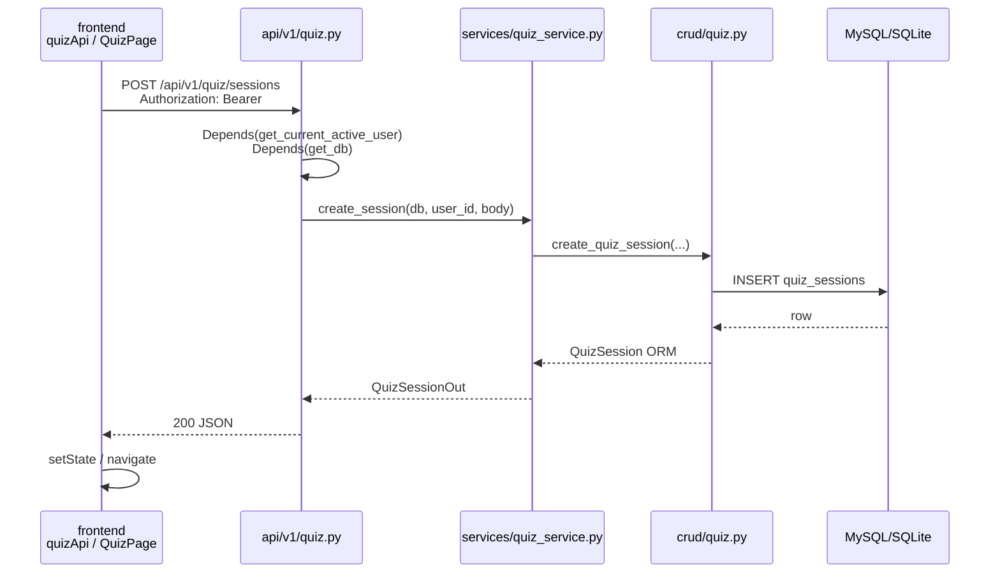
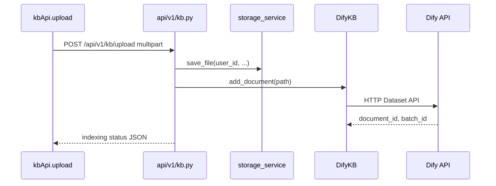
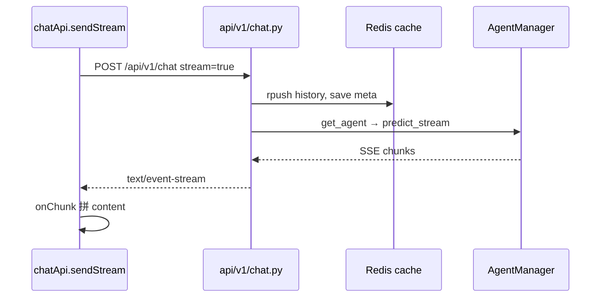

# 知拾 — 开发新功能实操指南

> **读者**：需要在本仓库里加 API / 页面 / 落库能力的开发者  
> **与 IMPLEMENTATION.md 的分工**：`IMPLEMENTATION.md` 按 S0–S8 阶段描述「做什么、验收什么」；**本文描述「按现有代码怎么写」**  
> **数据模型真源**：[`backend/docs/DATABASE.md`](../backend/docs/DATABASE.md)  
> **接口契约**：[`backend/docs/API.md`](../backend/docs/API.md)（实现后回写）

---

## 0. 范本选择说明

仓库里**并非所有模块都走同一套分层**，开发前先判断你的功能属于哪一类：

| 类型 | 代表模块 | 分层 | 适用场景 |
|------|----------|------|----------|
| **A. MySQL ORM 全链路** | `auth`、`plan` | router → service/crud → crud → models | 新表落库：`kb_collections`、`quiz_sessions` 等 |
| **B. 外部服务 + 薄路由** | `kb`、`dashboard` | router → `app/services/*`（Dify / 文件 / LLM） | 知识库上传、Dify 检索 |
| **C. Redis/文件 + Schema** | `chat` | router + `schemas` + Redis/`storage_service` | 会话、流式 SSE |

**本文主范本**：

- **后端落库新能力**（刷题 session、知识库分区）：以 **`auth` / `plan` 为四层范本**，表结构对照 `DATABASE.md`
- **后端 API 形态**（鉴权、`HTTPException`、路由注册）：同时参考 **`chat`**（Pydantic `response_model`）与 **`kb`**（文件上传、`UploadFile`）
- **前端联调**：以 **`kb`** 为范本（`kbApi` + `features/knowledge-base/`）

> 若只做「扩展已有 kb 上传」→ 改 `kb.py` + `kbApi` 即可，不必新建 models。  
> 若做 PLAN 新表 → 必须走 **A 类全链路**。

---

## 1. 仓库目录速查

```
zhishi/
├── backend/
│   ├── server.py                 # FastAPI 入口、lifespan、挂载 /api/v1
│   └── app/
│       ├── api/
│       │   ├── deps.py           # get_db、get_current_user、get_current_active_user
│       │   └── v1/
│       │       ├── router.py     # 汇总注册各模块 router
│       │       ├── auth.py       # 范本 A：ORM + AuthManager + crud
│       │       ├── plan.py       # 范本 A：薄 router + crud
│       │       ├── kb.py         # 范本 B：Dify + 本地存储
│       │       └── chat.py       # 范本 C：Redis + schemas
│       ├── core/
│       │   ├── config.py         # 环境变量、DATABASE_URL
│       │   └── database.py       # engine、SessionLocal、init_db
│       ├── models/models.py      # User、PlanTier（其余表见 IMPLEMENTATION S1）
│       ├── schemas/schemas.py    # Pydantic（auth + chat 模型在此）
│       ├── crud/crud.py          # 用户/套餐查询
│       └── services/             # 业务编排（auth_service、dify_kb、storage_service…）
├── frontend/src/
│   ├── lib/api.ts                # 统一 HTTP 客户端 + xxxApi 对象
│   ├── types/index.ts            # 前端全局 TS 类型
│   ├── routes/index.tsx          # React Router 注册
│   ├── features/                 # 按页面划分（knowledge-base、chat…）
│   └── data/nav.ts               # 侧栏导航（新页面需同步）
└── docs/
    ├── DEV_GUIDE.md              # 本文
    └── IMPLEMENTATION.md         # 分阶段任务与验收
```

---

## 2. 新增后端 API（完整步骤）

以下以 **「刷题 session」**（`quiz_sessions` 表，见 `DATABASE.md` §6.1）为例；**「知识库分区」**（`kb_collections`，§4.1）步骤相同，仅换模型名与 CRUD 函数。

### 2.1 在 `models/` 增加 ORM 模型

**参考**：现有 `User` 定义方式。

```5:37:backend/app/models/models.py
class User(Base):
    __tablename__ = "users"
    
    # 字段顺序必须严格与数据库表一致
    id = Column(Integer, primary_key=True, index=True)
    email = Column(String(255), unique=True, index=True, nullable=False)
    ...
    dataset_id = Column(String(255), nullable=True)
```

**你要做的**（S1 阶段，见 `IMPLEMENTATION.md` §S1）：

1. 新建 `backend/app/models/quiz_session.py`（或按 IMPLEMENTATION 拆分 `quiz.py`）
2. `__tablename__` **必须与** `DATABASE.md` 一致，例如 `"quiz_sessions"`
3. UUID 主键用 `String(36)`，默认值 `str(uuid.uuid4())`
4. 所有用户资源表带 `user_id = Column(Integer, ForeignKey("users.id"), index=True, nullable=False)`
5. 在 `backend/app/models/__init__.py` 导出，确保 `init_db()` 能 `create_all`：

```1:1:backend/app/models/__init__.py
from .models import User, PlanTier
```

扩展为：`from .quiz_session import QuizSession` 等。

**表字段对照**（摘自 DATABASE.md）：

| 字段 | 类型 | 说明 |
|------|------|------|
| id | VARCHAR(36) PK | UUID |
| user_id | INTEGER FK | 必须索引 |
| collection_id | VARCHAR(36) FK | 可选 |
| document_id | VARCHAR(36) FK | 可选 |
| title | VARCHAR(200) | |
| status | VARCHAR(20) | `active` / `completed` |
| started_at / finished_at | DATETIME | |

团队环境以 **Alembic migration** 为准（`IMPLEMENTATION.md` S1），本地可暂用 `init_db()`。

---

### 2.2 在 `schemas/` 增加 Request / Response

**参考**：chat 的请求/响应模型写在 `schemas/schemas.py`；新模块量大时可拆 `schemas/quiz.py`（IMPLEMENTATION S5 约定）。

```190:215:backend/app/schemas/schemas.py
class ChatRequest(BaseModel):
    content: str
    session_id: Optional[str] = None
    stream: bool = False

class ChatResponse(BaseModel):
    session_id: str
    session_title: Optional[str] = None
    role: str
    content: str
    created_at: datetime
...
class ChatSessionList(BaseModel):
    sessions: List[ChatSession]
```

**刷题 session 示例**（新建 `schemas/quiz.py`）：

```python
from pydantic import BaseModel, ConfigDict
from datetime import datetime
from typing import Optional, List

class QuizSessionCreate(BaseModel):
    document_id: Optional[str] = None
    collection_id: Optional[str] = None
    question_ids: Optional[List[str]] = None

class QuizSessionOut(BaseModel):
    id: str
    user_id: int
    title: Optional[str] = None
    status: str
    started_at: datetime
    model_config = ConfigDict(from_attributes=True)

class QuizAnswerSubmit(BaseModel):
    question_id: str
    user_answer: str
    status: Optional[str] = None  # correct | wrong | unknown
    time_spent_seconds: Optional[int] = None
```

路由上用 `response_model=QuizSessionOut` 约束 OpenAPI 与返回结构。

---

### 2.3 在 `crud/` 增加数据访问

**参考**：`crud/crud.py` 只做 DB 读写，不含 HTTP、不含 LLM。

```7:17:backend/app/crud/crud.py
def get_user_by_email(db: Session, email: str):
    """根据邮箱获取用户"""
    return db.query(User).filter(User.email == email).first()

def get_user_by_id(db: Session, user_id: int):
    """根据ID获取用户"""
    return db.query(User).filter(User.id == user_id).first()
```

**刷题 CRUD 示例**（新建 `crud/quiz.py`）：

```python
from sqlalchemy.orm import Session
from app.models.quiz_session import QuizSession

def create_quiz_session(db: Session, *, user_id: int, **fields) -> QuizSession:
    row = QuizSession(user_id=user_id, **fields)
    db.add(row)
    db.commit()
    db.refresh(row)
    return row

def get_quiz_session(db: Session, user_id: int, session_id: str):
    return (
        db.query(QuizSession)
        .filter(QuizSession.id == session_id, QuizSession.user_id == user_id)
        .first()
    )
```

**强制规则**：凡带 `user_id` 的查询必须过滤 `user_id == current_user["user_id"]`，防止越权。

---

### 2.4 在 `services/` 增加业务逻辑

**参考**：复杂流程放在 service，router 只调一个入口。

`AuthManager.register` 模式——校验 → crud → 外部服务 → commit：

```22:65:backend/app/services/auth_service.py
class AuthManager:
    @staticmethod
    def register(db: Session, email: str, password: str, nickname: str, ...):
        ...
        if crud.get_user_by_email(db, email=email):
            raise HTTPException(
                status_code=status.HTTP_400_BAD_REQUEST,
                detail="该邮箱已被注册"
            )
        ...
        db.add(new_user)
        try:
            db.commit()
            db.refresh(new_user)
        except Exception as e:
            db.rollback()
            raise HTTPException(status_code=500, detail="注册失败，请稍后重试")
```

**刷题 service**（新建 `services/quiz_service.py`）应负责：

1. 从 `user_question_refs` 拉题（S4 完成后）
2. shuffle 写入 `quiz_session_questions`
3. 提交答案时比对 `global_questions.answer`
4. 错题组装 `citation`（segment 原文）
5. 事务：`try / commit / except rollback`

Router **不写 SQL**，不直接 `db.query(...)`（`plan.py` 里少量直查是历史代码，新功能请走 service/crud）。

---

### 2.5 在 `api/v1/` 加路由并在 `router.py` 注册

**新建** `backend/app/api/v1/quiz.py`：

```python
from fastapi import APIRouter, Depends, HTTPException, status
from sqlalchemy.orm import Session

from app.api.deps import get_db, get_current_active_user
from app.schemas.quiz import QuizSessionCreate, QuizSessionOut, QuizAnswerSubmit
from app.services import quiz_service

router = APIRouter(tags=["刷题"])

@router.post("/sessions", response_model=QuizSessionOut)
def create_session(
    body: QuizSessionCreate,
    current_user: dict = Depends(get_current_active_user),
    db: Session = Depends(get_db),
):
    return quiz_service.create_session(db, user_id=current_user["user_id"], body=body)

@router.post("/sessions/{session_id}/answers")
def submit_answer(
    session_id: str,
    body: QuizAnswerSubmit,
    current_user: dict = Depends(get_current_active_user),
    db: Session = Depends(get_db),
):
    result = quiz_service.submit_answer(
        db, user_id=current_user["user_id"], session_id=session_id, body=body
    )
    if result is None:
        raise HTTPException(status_code=404, detail="会话不存在")
    return result
```

**注册**（与现有模块并列）：

```1:10:backend/app/api/v1/router.py
from fastapi import APIRouter
from app.api.v1 import auth, plan, chat, kt, kb, dashboard

api_router = APIRouter()
api_router.include_router(auth.router, prefix="/auth", tags=["账号认证"])
...
api_router.include_router(dashboard.router, prefix="/dashboard", tags=["首页建议"])
```

追加：

```python
from app.api.v1 import quiz
api_router.include_router(quiz.router, prefix="/quiz", tags=["刷题"])
```

最终 URL 前缀：`/api/v1/quiz/sessions`（`server.py` 已挂载 `prefix="/api/v1"`）。

```92:93:backend/server.py
from app.api.v1.router import api_router
app.include_router(api_router, prefix="/api/v1")
```

**知识库分区**同理：新建 `collections.py`，`prefix="/collections"`，CRUD `kb_collections` 表。

---

### 2.6 Session 获取与鉴权挂载

**DB Session** — `deps.get_db` 生成器，路由参数注入：

```10:15:backend/app/api/deps.py
def get_db():
    db = SessionLocal()
    try:
        yield db
    finally:
        db.close()
```

用法（与 `auth.py` 一致）：

```python
def some_route(db: Session = Depends(get_db)):
    ...
```

**鉴权** — Token 从 Redis 读 session，**不是** JWT 解 user 表：

```17:28:backend/app/api/deps.py
async def get_current_user(token: str = Depends(oauth2_scheme)):
    user_info = cache.get_session(token)
    if not user_info:
        raise HTTPException(status_code=401, detail="Session expired")
    return user_info  # 字典：user_id, email, level, dataset_id, is_active...

def get_current_active_user(current_user: dict = Depends(get_current_user)):
    if not current_user.get("is_active", True):
        raise HTTPException(status_code=400, detail="Inactive user")
    return current_user
```

**需要登录的接口**统一写：

```python
current_user: dict = Depends(get_current_active_user)
```

然后 `user_id = current_user["user_id"]`，`dataset_id = current_user.get("dataset_id")`。

**公开接口**（注册、登录）只挂 `Depends(get_db)`，不挂 user。

**kb 现有写法**（无 DB，仅有鉴权）：

```94:98:backend/app/api/v1/kb.py
@router.post("/upload")
async def upload_document(
    file: UploadFile = File(...),
    current_user: dict = Depends(get_current_active_user),
):
```

---

### 2.7 错误处理与 HTTP 状态码约定

项目内**实际用法**（从 `auth`、`kb`、`chat` 归纳）：

| 场景 | 状态码 | 写法 |
|------|--------|------|
| 参数/业务校验失败 | 400 | `HTTPException(status_code=400, detail="...")` |
| 未登录 / Token 失效 | 401 | `deps` 或 `api.ts` 401 清 token |
| 资源不存在 | 404 | `HTTPException(status_code=404, detail="...")` |
| 文件过大 | 413 | kb 上传：`status.HTTP_413` |
| 解析/OCR 失败 | 422 | `status.HTTP_422_UNPROCESSABLE_ENTITY` |
| 冲突（题未生成完就刷题） | 409 | IMPLEMENTATION S5 约定 |
| 外部服务失败（Dify） | 502 | kb：`HTTP_502_BAD_GATEWAY` |
| 未捕获异常 | 500 | `logger.error(...); raise HTTPException(500, detail=...)` |

**模式**：

```python
try:
    return SomeService.do_work(...)
except HTTPException:
    raise          # 原样抛出，勿吞掉
except Exception as e:
    logger.error(f"...: {e}", exc_info=True)
    raise HTTPException(status_code=500, detail="...")
```

chat 的业务校验示例：

```264:268:backend/app/api/v1/chat.py
    if session_meta is None and not request.content:
        raise HTTPException(
            status_code=status.HTTP_400_BAD_REQUEST,
            detail="新会话必须提供 content"
        )
```

前端 `api.ts` 会把非 2xx 的 `detail` 解析成 `Error` 抛出。

---

### 2.8 扩展已有 kb 模块（不落库时）

若 S2 尚未完成、仅改 Dify 流程：**不要新建 models**，直接改：

- `backend/app/api/v1/kb.py` — 路由
- `backend/app/services/dify_kb.py` — Dify HTTP
- `backend/app/services/storage_service.py` — 本地文件

```39:42:backend/app/services/dify_kb.py
    def __init__(self, dataset_id: str):
        if not dataset_id:
            raise ValueError("dataset_id 不能为空")
        self.dataset_id = dataset_id
```

路由内 `_get_kb(user_id, dataset_id)` 与 `current_user.get("dataset_id")` 模式见 `kb.py` 第 29–36、112–113 行。

---

## 3. 新增前端页面（完整步骤）

以 **刷题页** 为例；扩展知识库 UI 则对照 `features/knowledge-base/`。

### 3.1 在 `api.ts` 增加 `xxxApi`

**参考** `kbApi` / `chatApi` 结构：共用 `request()`，自动带 Bearer Token。

```26:65:frontend/src/lib/api.ts
async function request<T = any>(
  method: string,
  path: string,
  body?: any,
  isFormData?: boolean
): Promise<T> {
  const url = `${API_BASE}${path}`
  ...
  if (token) {
    headers["Authorization"] = `Bearer ${token}`
  }
  ...
  if (res.status === 401) {
    setToken(null)
    throw new Error("登录已过期，请重新登录")
  }
  ...
}
```

```170:196:frontend/src/lib/api.ts
export const kbApi = {
  upload(file: File) {
    const formData = new FormData()
    formData.append("file", file)
    return request<any>("POST", "/api/v1/kb/upload", formData, true)
  },
  listDocuments(page = 1, limit = 20) {
    return request<any>("GET", `/api/v1/kb/documents?page=${page}&limit=${limit}`)
  },
  ...
}
```

**刷题 API 示例**（追加到同文件）：

```typescript
export const quizApi = {
  createSession(body: { document_id?: string; collection_id?: string }) {
    return request<any>("POST", "/api/v1/quiz/sessions", body)
  },
  getSession(sessionId: string) {
    return request<any>("GET", `/api/v1/quiz/sessions/${sessionId}`)
  },
  submitAnswer(sessionId: string, body: { question_id: string; user_answer: string; status?: string }) {
    return request<any>("POST", `/api/v1/quiz/sessions/${sessionId}/answers`, body)
  },
  getReview(sessionId: string) {
    return request<any>("GET", `/api/v1/quiz/sessions/${sessionId}/review`)
  },
}
```

**流式接口**（如 chat）不走 `request()`，需单独 `fetch` + SSE 解析，见 `chatApi.sendStream`。

**本地 API 地址**：`IMPLEMENTATION.md` §5.3 建议改为 `import.meta.env.VITE_API_BASE`；当前文件顶部为常量，本地开发时在 `frontend/.env.development` 配置 `VITE_API_BASE=http://127.0.0.1:8765` 并改 `api.ts` 读取该变量。

---

### 3.2 在 `features/` 建页面/组件

**参考** `KnowledgeBasePage.tsx`：

```32:50:frontend/src/features/knowledge-base/KnowledgeBasePage.tsx
  useEffect(() => {
    kbApi.listDocuments()
      .then((res) => {
        const items = res.data || res.documents || []
        setDocs(
          items.map((d: any) => ({
            id: d.id,
            name: d.name || d.file_name || d.id,
            ...
          }))
        )
      })
      .catch(() => setDocs([]))
      .finally(() => setLoading(false))
  }, [])
```

**惯例**：

1. 目录：`frontend/src/features/quiz/QuizPage.tsx`（可按子组件拆分）
2. 布局：外层 `AppShell`，标题用 `PageHeader`（与 kb/chat 一致）
3. 状态：`useState` + `useEffect` 拉数；提交用 `async` handler + loading 态
4. 兼容后端字段：响应结构可能为 `res.documents` 或 `res.data`，做 fallback（见上）

**Chat 流式发送**参考 `ChatPage.tsx` 中 `chatApi.sendStream` 与 session 列表 `chatApi.getSessions()`。

---

### 3.3 路由注册

**文件**：`frontend/src/routes/index.tsx`

```35:51:frontend/src/routes/index.tsx
export function AppRoutes() {
  return (
    <Routes>
      <Route path="/login" element={<LoginPage />} />
      <Route path="/" element={<RequireAuth><DashboardPage /></RequireAuth>} />
      <Route path="/chat" element={<RequireAuth><ChatPage /></RequireAuth>} />
      ...
      <Route path="/knowledge" element={<RequireAuth><KnowledgeBasePage /></RequireAuth>} />
      <Route path="/knowledge/upload" element={<RequireAuth><UploadPage /></RequireAuth>} />
      ...
    </Routes>
  )
}
```

新增刷题页：

```typescript
import { QuizPage } from "@/features/quiz/QuizPage"
// ...
<Route path="/quiz" element={<RequireAuth><QuizPage /></RequireAuth>} />
<Route path="/quiz/:sessionId" element={<RequireAuth><QuizPage /></RequireAuth>} />
```

**侧栏入口**：`frontend/src/data/nav.ts` 的 `navGroups` 增加 `{ label: "刷题", to: "/quiz", icon: ... }`。

---

### 3.4 类型定义放哪

| 范围 | 位置 | 示例 |
|------|------|------|
| 跨页面复用 | `frontend/src/types/index.ts` | `KnowledgeDoc`、`ChatMessage` |
| 仅单页使用 | 页面文件顶部 `interface` | `UploadPage` 的 `UploadTask` |
| 静态 mock | `frontend/src/data/*.ts` | `data/knowledge.ts` |

刷题相关建议新增：

```typescript
// types/index.ts
export interface QuizSession {
  id: string
  title?: string
  status: "active" | "completed"
  started_at: string
}

export interface QuizQuestion {
  id: string
  stem: string
  options: string[]
}
```

页面内 `import type { QuizSession } from "@/types"`。

---

## 4. 端到端数据流

### 4.1 落库型新 API（刷题 / 分区）



### 4.2 现有 kb 上传（无 ORM）



### 4.3 chat 发消息（Redis + 可选 SSE）



---

## 5. 与 IMPLEMENTATION.md 各阶段的对应关系

| IMPLEMENTATION 阶段 | 本文章节 | 主要动作 |
|----------------------|----------|----------|
| **S0** 环境联调 | §6 本地启动 | 不改代码，验证 health / 登录 |
| **S1** DB 与 ORM | §2.1、§2.3 | models + crud 文件 + Alembic |
| **S2** 分区与文档 | §2.1–§2.5、§2.8 | `kb_collections`/`documents` schema/service/collections 路由；迁移 kb 去重 |
| **S3** 分段 | §2.4 | `segment_service.py`，可无新 router 或加 `segments.py` |
| **S4** 出题 | §2.2–§2.5 | `question.py` schema、`questions.py` 路由 |
| **S5** 刷题 | §2 全文 + §3 | `quiz.py` 全链路 + 前端 QuizPage |
| **S6** 辅导 | §2 同构 | `tutor.py` + 绑定 segment 上下文 |
| **S7** 聊天 citation | §2.5 + chat 扩展 | 扩展 `ChatResponse` / SSE payload |
| **S8** 前端闭环 | §3 全文 | 联调、nav、类型 |

**阅读顺序**：先在本仓库 **S0 跑通** → 按 IMPLEMENTATION 阶段号推进 → 每阶段具体「写哪些文件」查 IMPLEMENTATION 该节「新建/修改文件」清单，**「怎么写」查本文 §2–§3**。

---

## 6. 本地开发最小启动

不依赖远程后端是否可达；本机起服务即可。

**后端**（在 `backend/` 目录）：

```bash
uvicorn server:app --host 127.0.0.1 --port 8765
```

`server.py` lifespan 会执行 `init_db()`、加载 LEKT、初始化 `AgentManager`。

**前端**（在 `frontend/` 目录）：

```bash
npm run dev
```

配置 `frontend/.env.development` 中 `VITE_API_BASE=http://127.0.0.1:8765`，并让 `api.ts` 读取该变量（见 `IMPLEMENTATION.md` §5.3）。

**快速自检**：`GET http://127.0.0.1:8765/health` → 200；前端登录后进 Dashboard。

---

## 7. 启动与依赖注入（server.py）

```29:58:backend/server.py
@asynccontextmanager
async def lifespan(app: FastAPI):
    # 1. 初始化数据库
    try:
        from app.core.database import init_db
        init_db()
        ...
    # 2. 加载 LEKT 推理模型
    ...
    app.state.lekt = lekt
    # 3. 初始化 AgentManager
    ...
    app.state.agent_manager = AgentManager()
    yield
```

- **DB**：路由内 `Depends(get_db)`，与 lifespan 无直接耦合
- **LEKT**：`kt.py` 通过 `app.state.lekt` 或模块内 getter
- **Agent**：chat 流式用 `from app.core.agent_manager import agent_manager`

新功能若需全局单例，在 lifespan 挂载到 `app.state.xxx`，并提供 getter；或像 `storage_service` 一样模块级单例。

---

## 8. 自检清单（提交 PR 前）

- [ ] `router.py` 已 `include_router`，URL 与 `API.md` 一致
- [ ] 需登录路由均挂 `get_current_active_user`
- [ ] 用户数据查询带 `user_id` 过滤
- [ ] Pydantic `response_model` 与前端 `types` 字段对齐
- [ ] `frontend/src/routes/index.tsx` + `data/nav.ts` 已注册
- [ ] `api.ts` 新方法路径以 `/api/v1/` 开头
- [ ] 错误场景返回明确 `detail`，非裸 500 字符串

---

## 9. 相关文档

| 文档 | 用途 |
|------|------|
| [IMPLEMENTATION.md](./IMPLEMENTATION.md) | S0–S8 任务分解与验收 |
| [PLAN.md](./PLAN.md) | 产品方向 |
| [backend/docs/DATABASE.md](../backend/docs/DATABASE.md) | 表名、字段、ER |
| [backend/docs/API.md](../backend/docs/API.md) | 已有接口契约 |
