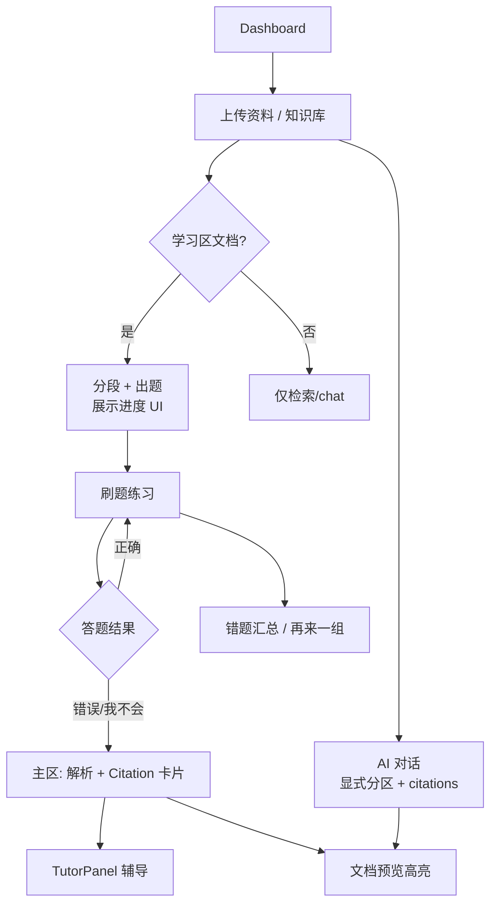

# 知拾 UI/UX 改进清单

> **文档版本**：2026-07-02  
> **关联文档**：[PLAN.md](./PLAN.md) · [IMPLEMENTATION.md](./IMPLEMENTATION.md) · [DEV_GUIDE.md](./DEV_GUIDE.md)

---

## 1. 文档目的与读者

### 目的

S8 前端已完成 API 接线与页面骨架，但产品体验仍偏「功能可用」而非「学习闭环可感知」。本文档将 S8 UI 评估结论整理为**可排期、可验收**的改进项，供下一步决定是否进入 **S8.5 polish** 或拆入后续迭代。

### 读者

| 角色 | 用法 |
|------|------|
| 产品 / 设计 | 对齐 PLAN 目标，确认优先级与动线 |
| 前端开发 | 按项改文件、估工作量、对照组件规范 |
| 联调 / 验收 | 对照 IMPLEMENTATION S8 验收与本文 §7 边界 |

---

## 2. 设计原则（与 PLAN 对齐）

1. **学习提升优先**：首页与导航应引导「上传 → 出题 → 刷题 → 错题理解 → 辅导」，而非泛化的笔记/图谱/提醒。
2. **刷题 + 辅导 + 原文**：答错或「我不会」时，**主视觉区**必须呈现解析与可定位原文（PLAN §1.5–1.6）；辅导 Agent 绑定分段上下文，不另起一套无关聊天体验。
3. **分区上下文可见**：聊天与刷题前，用户应明确当前在「学习区 / 生活区」哪一分区检索（PLAN §3.1）。
4. **Citation 可行动**：引用不止展示 snippet，应一键打开文档预览并高亮 `char_start/end`（IMPLEMENTATION S7/S8）。
5. **延续现有设计语言**：shadcn/ui + Tailwind + `AppShell` / `PageHeader` / `SegmentedTabs`；不引入新 UI 库，优先复用 `frontend/src/components/ui/*`。
6. **状态可感知**：分段、出题、索引等异步步骤需有进度或阻塞说明，避免用户反复点「开始刷题」报 409。

---

## 3. 当前 S8 状态摘要

S8 已在 React 端接通 `VITE_API_BASE`、知识库分区、刷题会话、辅导 SSE、聊天 `collection_id` 与 `citations[]`，整体视觉延续 shadcn/Tailwind/`AppShell` 体系。实现重心在**接口对接**：`QuizPage` / `ChatPage` / `KnowledgeBasePage` / `UploadPage` 等页面可用，但信息架构仍残留「第二大脑」时代入口（Dashboard 快捷操作为笔记/图谱/上传，无刷题）；刷题错题 citation 与 `TutorPanel` 挤在右侧栏，主答题区仅文字反馈；聊天分区选择为右侧 `RightPanel` 内原生 `<select>`；知识库 `SearchInput` 未接 API；文档 `segment_status` / `question_gen_status` 未在列表展示。距离 IMPLEMENTATION 定义的 MVP 一句话闭环，**缺的是产品动线与关键反馈区的 UI 设计落地**，而非后端能力。

---

## 4. 改进项清单

优先级说明：

- **P0**：不解决则 MVP 学习闭环难完成或用户找不到核心能力  
- **P1**：显著影响体验一致性或 PLAN 诉求，但不阻塞基本走通  
- **P2**： polish、数据真实化、导航整理  

工作量：**S**（≤0.5 天）· **M**（1–2 天）· **L**（≥3 天或跨多页）

---

### P0 — 闭环与核心反馈

#### P0-1 Dashboard 缺少刷题与学习闭环入口 ✅ 已完成（S8.5）

| 维度 | 内容 |
|------|------|
| **问题** | 快捷操作仅有「新建笔记 / AI 对话 / 上传 / 知识图谱」，无「刷题练习」；推荐卡片与 Tina 建议仍强调上传与画像，未指向「学习区文档 → 刷题」。 |
| **对应 PLAN** | §1 用户通过刷题与 Agent 询问得到提升；§2 学习区资料驱动题库 |
| **对应页面** | `/` Dashboard |
| **建议改法** | ① `quickActions` 增加「刷题练习」→ `/quiz`（Brain 图标，与侧栏一致）；② `RecommendCard` 文案改为「上传学习区文档 → 自动出题 → 开始刷题」；③ 最近内容中文档项增加 secondary 操作「去刷题」→ `/quiz?document_id=`；④ 右栏「快捷入口」增加「刷题练习」「知识库」。 |
| **涉及文件** | `frontend/src/features/dashboard/DashboardPage.tsx`、`frontend/src/data/dashboard.ts`（若抽配置） |
| **工作量** | S |
| **备注** | 2026-07-02：快捷操作改为刷题/上传/对话/知识库；RecommendCard 闭环文案；最近文档 hover「去刷题」；右栏快捷入口更新 |

#### P0-2 答错/我不会时，原文 citation 应在主答题区而非仅侧栏 ✅ 已完成（S8.5）

| 维度 | 内容 |
|------|------|
| **问题** | 提交答案后，主栏只显示对错、解析文字；`citation.snippet` 与「查看原文」仅在右侧 `QuizReviewPanel` 或 Tutor 打开后才可见。PLAN 要求答错后**在下面**放出原文。 |
| **对应 PLAN** | §1.6 答错自动展示原文与解析 |
| **对应页面** | `/quiz` 答题阶段（`phase === "quiz"`） |
| **建议改法** | 在 `lastResult` 展示块内（解析下方）增加 **Citation 卡片**（见 §6）：snippet 摘要 + `CitationPreviewButton` + 可选「展开分段标题」；侧栏 `QuizReviewPanel` 保留汇总列表。答对时可不展示 citation。 |
| **涉及文件** | `frontend/src/features/quiz/QuizPage.tsx`；新建 `frontend/src/components/blocks/CitationCard.tsx`（推荐） |
| **工作量** | M |
| **备注** | 2026-07-02：新增 `CitationCard`；QuizPage 主区 wrong/unknown 展示 citation；QuizReviewPanel 复用 compact 变体 |

#### P0-3 分段/出题进度无 UI，用户不知何时可刷题 ✅ 已完成（S8.5）

| 维度 | 内容 |
|------|------|
| **问题** | `QuizPage` setup 仅「开始刷题 / 为该文档出题」，无 `segment_status`、`question_gen_status` 展示；`handleGenerateQuestions` 无轮询；创建会话 409 时只有 error 文案。上传页轮询索引，但不覆盖出题。 |
| **对应 PLAN** | §2 学习区自动索引与出题；IMPLEMENTATION S8 常见坑「出题异步需轮询」 |
| **对应页面** | `/quiz` setup、`/knowledge` 文档列表、`/knowledge/upload` 任务完成态 |
| **建议改法** | ① 文档 `<select>` 旁或选项内展示状态徽章：`分段中 / 已分段 / 出题中 / 可刷题（N 题）`（`GET /kb/documents` + `GET /questions?document_id=`）；② 「为该文档出题」点击后轮询 `question_gen_status` 或题数，禁用「开始刷题」直到 `completed` 或题数 &gt; 0；③ 409 时用 `Alert` 说明「请先等待分段/出题完成」并链到知识库该文档。 |
| **涉及文件** | `frontend/src/features/quiz/QuizPage.tsx`、`frontend/src/features/knowledge-base/KnowledgeBasePage.tsx`、`frontend/src/lib/api.ts`（确认 documents/questions 字段）、`frontend/src/types/index.ts` |
| **工作量** | M |
| **备注** | 2026-07-02：新增 `DocumentPipelineBadge`；Quiz setup shadcn Select + 状态；出题轮询；409 Alert；知识库 DocRow 展示分段/出题状态 |

#### P0-4 聊天知识库分区选择不显眼且使用原生 select ✅ 已完成（S8.5）

| 维度 | 内容 |
|------|------|
| **问题** | `collection_id` 选择器位于 `RightPanel` 底部，用户主视线在输入框；原生 `<select>` 与全站 SegmentedTabs 不一致；切换分区无「当前对话将检索 XX 分区」提示。 |
| **对应 PLAN** | §3.1 进入对话时选择知识库分区 |
| **对应页面** | `/chat` |
| **建议改法** | ① 将分区选择提升到**输入区上方或左侧**：用 `SegmentedTabs`（≤3 分区）或 shadcn `Select` + `Badge`（学习区/生活区）；② 发送首条消息前若未选分区，用默认学习区并显示只读提示；③ 移除或同步右侧重复配置。 |
| **涉及文件** | `frontend/src/features/chat/ChatPage.tsx` |
| **工作量** | M |
| **备注** | 2026-07-02：输入区上方 shadcn Select + Badge 提示；移除无功能「关联知识库」；右栏改为只读分区展示 |

#### P0-5 本地 MVP 验收项前端仍有一项未勾选

| 维度 | 内容 |
|------|------|
| **问题** | IMPLEMENTATION S8 验收：「本地 npm run dev + 后端完整走通 MVP 一句话」仍为 `[ ]`；Dashboard 动线缺失导致闭环体验不完整。 |
| **对应 PLAN** | MVP 验收一句话（IMPLEMENTATION §3） |
| **对应页面** | 全站联调 |
| **建议改法** | 完成 P0-1～P0-4 后，按 DEV_GUIDE 走一遍：注册 → 上传 `.md` 到学习区 → 等待分段/出题 UI → 刷题 → 错题原文 → 「我不会」辅导；补全各页 loading/error 空态（见 P1-7）。 |
| **涉及文件** | 多文件；`docs/IMPLEMENTATION.md` 验收勾选（文档维护，非本任务范围） |
| **工作量** | S（验证）+ 依赖 P0-1～4 |

---

### P1 — 体验一致性与 PLAN 深化

#### P1-1 刷题页文档选择使用原生 select ✅ 已完成（S8.5）

| 维度 | 内容 |
|------|------|
| **问题** | `QuizPage` setup 中 `<select>` 与 `UploadPage` / `KnowledgeBasePage` 的 `SegmentedTabs` 风格割裂。 |
| **对应 PLAN** | §2 按学习区/文档组织题库 |
| **对应页面** | `/quiz` setup |
| **建议改法** | 换用 `@/components/ui/select`（Radix）或文档列表 `Command`  combobox；选项内附带出题状态小字。 |
| **涉及文件** | `frontend/src/features/quiz/QuizPage.tsx` |
| **工作量** | S |
| **备注** | 2026-07-02：QuizPage setup 已换 shadcn Select，选项含 pipeline 状态 |

#### P1-2 TutorPanel 与 Chat 体验分裂 ⏳ 部分完成

| 维度 | 内容 |
|------|------|
| **问题** | 辅导使用独立 `TutorPanel`（右侧栏替换错题回顾），消息气泡样式与 `ChatPage` / `ChatMessage` 不一致；无 citation、无会话历史入口；用户感知为两个产品。 |
| **对应 PLAN** | §1.5 「我不会，想和 Agent 聊聊」 |
| **对应页面** | `/quiz` 右侧栏；`/chat` |
| **建议改法** | ① 抽取共享 `ConversationThread` + 输入框组件，Tutor 与 Chat 共用；② Tutor 顶栏保留「题目题干 + 分段摘要」，样式对齐 `ChatMessage` assistant 气泡；③ 可选：辅导结束后提供「在聊天中继续」跳转（带 `question_id` 查询参数，v1 可仅文案）。 |
| **涉及文件** | `frontend/src/features/tutor/TutorPanel.tsx`、`frontend/src/components/blocks/ChatMessage.tsx`、新建 `frontend/src/components/blocks/ConversationComposer.tsx` |
| **工作量** | L |
| **备注** | 2026-07-02：TutorPanel 消息气泡样式对齐 ChatMessage；未抽取共享 ConversationThread |

#### P1-3 知识库搜索为占位，无法检索文档

| 维度 | 内容 |
|------|------|
| **问题** | `KnowledgeBasePage` 中 `SearchInput` 无 `onChange` / 无 API，placeholder「搜索文档...」不可用。 |
| **对应 PLAN** | §2 资料管理与查找 |
| **对应页面** | `/knowledge` |
| **建议改法** | MVP：前端对当前分区 `docs` 按文件名/filter 本地过滤；若后端已有搜索端点则接 API。空结果用 `EmptyState`。 |
| **涉及文件** | `frontend/src/features/knowledge-base/KnowledgeBasePage.tsx`、`frontend/src/components/ui/search-input.tsx` |
| **工作量** | S |

#### P1-4 知识库文档行缺少「刷题 / 出题」快捷操作

| 维度 | 内容 |
|------|------|
| **问题** | 点击文档仅打开预览；学习区文档无法从列表一键「刷这份文档」或触发出题。 |
| **对应 PLAN** | §1 对资料进行刷题 |
| **对应页面** | `/knowledge` |
| **建议改法** | `DocRow` 增加行内按钮（仅 `zone=study`）：「刷题」→ `/quiz?document_id=`；「出题」→ 调 `questionsApi.generate` 并展示进度（与 P0-3 复用状态组件）。 |
| **涉及文件** | `frontend/src/components/blocks/DocRow.tsx`、`frontend/src/features/knowledge-base/KnowledgeBasePage.tsx`、`frontend/src/features/quiz/QuizPage.tsx`（读取 URL query 预选文档） |
| **工作量** | M |

#### P1-5 Dashboard 文案与数据仍偏「第二大脑」

| 维度 | 内容 |
|------|------|
| **问题** | 搜索框 placeholder「搜索笔记、文档、标签」；右栏「学习时长 / 待复习 / 待整理」均为「—」占位；快捷入口含「创建提醒 / 学习路径」等非 MVP 能力。 |
| **对应 PLAN** | §0 从第二大脑转向学习提升 |
| **对应页面** | `/` |
| **建议改法** | ① 搜索 placeholder 改为「问 Tina 或搜索学习资料…」；② 右栏优先展示：最近刷题会话、待出题文档数（接 API 或暂隐藏占位项）；③ 降级非 MVP 入口到「学习」侧栏分组，Dashboard 只保留闭环相关。 |
| **涉及文件** | `frontend/src/features/dashboard/DashboardPage.tsx` |
| **工作量** | M |

#### P1-6 Citation 展示样式分散，未统一组件 ✅ 已完成（S8.5）

| 维度 | 内容 |
|------|------|
| **问题** | 刷题：`QuizReviewPanel` 左边框 snippet + 链接按钮；聊天：`ChatMessage` 底部按钮列表；聊天侧栏：纯文本链接；预览：`DocumentPreviewModal`。 |
| **对应 PLAN** | §3.2 引用可打开并高亮 |
| **对应页面** | `/quiz`、`/chat` |
| **建议改法** | 统一 `CitationCard` / `CitationChip`（§6）；各场景仅变 `variant`（inline / compact / list）。 |
| **涉及文件** | 新建 `frontend/src/components/blocks/CitationCard.tsx`；`QuizReviewPanel.tsx`、`ChatMessage.tsx`、`ChatPage.tsx` |
| **工作量** | M |
| **备注** | 2026-07-02：`CitationCard` 用于 quiz 主区、QuizReviewPanel、ChatMessage、Chat 右栏最近引用 |

#### P1-7 主要页面 loading / error 态不齐

| 维度 | 内容 |
|------|------|
| **问题** | IMPLEMENTATION S8 验收要求 loading/error 齐全；部分页面 catch 后静默（如 Chat 会话列表）。 |
| **对应 PLAN** | 工程验收 |
| **对应页面** | `/quiz`、`/chat`、`/knowledge` |
| **建议改法** | 统一用 `EmptyState` + `Alert` + `Spinner`；API 失败可重试按钮。 |
| **涉及文件** | 各 feature 页面 |
| **工作量** | M |

#### P1-8 上传完成后缺少「去刷题」引导

| 维度 | 内容 |
|------|------|
| **问题** | `UploadPage` 任务 `completed` 仅显示「已入库 · 索引完成」，未提示学习区后续分段/出题，也无 CTA。 |
| **对应 PLAN** | §1 上传 → 刷题 |
| **对应页面** | `/knowledge/upload` |
| **建议改法** | 对学习区上传完成项增加按钮：「查看文档」「开始刷题」（文档 ID 已知）；若分段异步，显示「分段进行中，稍后可在刷题页查看状态」。 |
| **涉及文件** | `frontend/src/features/knowledge-base/UploadPage.tsx` |
| **工作量** | S |

---

### P2 — 信息架构与 polish

#### P2-1 侧栏导航顺序未突出学习主线

| 维度 | 内容 |
|------|------|
| **问题** | `navGroups` 顺序为 AI 对话 → 笔记 → 知识库 → 刷题；与 PLAN 主线「资料 → 刷题 → 辅导」不一致。 |
| **对应 PLAN** | 全站 IA |
| **对应页面** | 全局 `Sidebar` |
| **建议改法** | 「主要」分组顺序建议：知识库 → 刷题练习 → AI 对话 → 上传；笔记降为次要或合并入口。 |
| **涉及文件** | `frontend/src/data/nav.ts` |
| **工作量** | S |

#### P2-2 刷题完成页缺少 citation 汇总与复习入口

| 维度 | 内容 |
|------|------|
| **问题** | `phase === "done"` 有统计与 `QuizReviewPanel`，但无「按文档回到知识库」「再练错题」区分。 |
| **对应 PLAN** | §1 错题理解 |
| **对应页面** | `/quiz` done |
| **建议改法** | 增加 Tab：「错题回顾 / 全部题目」；CTA「只练错题」创建仅含错题 ID 的 session（需后端支持则标依赖）。 |
| **涉及文件** | `frontend/src/features/quiz/QuizPage.tsx` |
| **工作量** | M |

#### P2-3 Chat 欢迎语与模式 chip 仍偏通用助手

| 维度 | 内容 |
|------|------|
| **问题** | `welcomeMessage` 提「生成学习路径」；工具栏「生成笔记 / 语音输入」未接 API。 |
| **对应 PLAN** | §3 伴随知识库的回答 |
| **对应页面** | `/chat` |
| **建议改法** | 欢迎语强调当前分区与 citation；未实现工具改为 disabled + tooltip 或移除。 |
| **涉及文件** | `frontend/src/features/chat/ChatPage.tsx`、`frontend/src/data/chat.ts` |
| **工作量** | S |

#### P2-4 DocumentPreviewModal 高亮体验可增强

| 维度 | 内容 |
|------|------|
| **问题** | 高亮为 `<mark>`  substring，长文不自动 scroll into view；标题仅显示 char 范围数字。 |
| **对应 PLAN** | §3.2 打开并高亮 |
| **对应页面** | 全局预览 Modal |
| **建议改法** | `useEffect` 高亮元素 `scrollIntoView`；副标题改为分段 `title`。 |
| **涉及文件** | `frontend/src/components/blocks/DocumentPreviewModal.tsx` |
| **工作量** | S |

#### P2-5 上传页流程条与真实 pipeline 不完全一致

| 维度 | 内容 |
|------|------|
| **问题** | 流程条含「摘要/标签」，后端 MVP 未必逐步返回；易误导。 |
| **对应 PLAN** | §2 索引与 tag 难点 |
| **对应页面** | `/knowledge/upload` |
| **建议改法** | 学习区流程改为：上传 → 解析索引 → 分段 → （可选）出题；生活区可隐藏分段/出题步骤。 |
| **涉及文件** | `frontend/src/features/knowledge-base/UploadPage.tsx` |
| **工作量** | S |

---

## 5. 信息架构建议

### 5.1 导航层级（建议）

| 层级 | 条目 | 说明 |
|------|------|------|
| 首页 | Dashboard | 闭环 CTA + 继续学习 |
| 主线 | 知识库 → 刷题练习 → AI 对话 | 与 PLAN 顺序一致 |
| 支撑 | 上传资料 | 可保留独立入口，亦可在知识库页内嵌 |
| 次要 | 笔记、图谱、分析、路径、提醒 | MVP 可保留侧栏但不占 Dashboard C 位 |
| 个人 | 画像、设置、诊断 | 不变 |

### 5.2 Dashboard 区块建议

1. **主 CTA 行**：继续刷题（若有未完成 session）/ 开始刷题 / 上传学习资料  
2. **快捷操作**：刷题、知识库、上传、AI 对话（四宫格）  
3. **最近学习**：文档 + 刷题会话 + 错题数（API 就绪后）  
4. **右栏**：分区概览、待出题文档、Tina 建议（与刷题相关）

### 5.3 学习闭环动线



---

## 6. 组件规范

### 6.1 Select（分区 / 文档）

| 项 | 约定 |
|----|------|
| **禁止** | 原生 `<select>`（Quiz setup、Chat 右栏） |
| **推荐** | `@/components/ui/select` 或 `SegmentedTabs`（≤4 个固定分区） |
| **文档选择** | 选项格式：`文件名 · 分段完成 · N 道题`；禁用态说明原因 |
| **空态** | 无文档时 Select 禁用 + 链到 `/knowledge/upload` |

### 6.2 Citation 卡片（`CitationCard`）

**Props**（对齐 `types/index.ts` 的 `Citation`）：

```typescript
interface CitationCardProps {
  citation: Citation
  variant?: "default" | "compact" | "inline"
  showIndex?: number      // 列表序号，非文内 [1]
  onPreview?: () => void  // 默认打开 DocumentPreviewModal
}
```

**布局**：

- 标题行：`FileText` 图标 + `title` 或文档名（truncate）  
- 正文：`snippet` 最多 3 行，`line-clamp-3`  
- 操作：主按钮「查看原文并高亮」→ `CitationPreviewButton` / Modal  
- 样式：`rounded-lg border border-line-soft bg-surface-soft p-3`；左边框 `border-l-2 border-primary/40` 表示引用  

**使用场景**：

| 场景 | variant |
|------|---------|
| 刷题主区答错反馈 | `default` |
| QuizReviewPanel 列表 | `compact` |
| ChatMessage 底部 | `inline`（横向 chip + 预览） |

### 6.3 刷题反馈区（主栏）

答题卡底部固定结构（`lastResult != null` 时）：

1. **结果条**：图标 + 对错 / 「我不会」  
2. **解析块**：`explanation`（若有）  
3. **Citation 卡片**：仅 `wrong` / `unknown`  
4. **操作行**：「下一题」「和 Agent 聊聊」  

侧栏同步累积 `QuizReviewPanel`，但不替代主栏 citation。

### 6.4 文档处理状态徽章（`DocumentPipelineBadge`）

| 后端字段 | 展示文案 | 颜色 |
|----------|----------|------|
| `segment_status=processing` | 分段中 | warning |
| `segment_status=completed` | 已分段 | success |
| `question_gen_status=processing` | 出题中 | warning |
| `question_gen_status=completed` + 题数 N | 可刷题 · N 题 | primary |
| `failed` | 处理失败 | danger |

用于：知识库 `DocRow`、刷题文档 Select、上传任务完成 CTA。

### 6.5 刷题页布局

- **Desktop**：主栏题目 + 反馈（宽）｜侧栏错题列表或 Tutor（窄，≥320px）  
- **Mobile**：主栏完整反馈含 Citation；Tutor 用 `Sheet` 全屏弹出，避免挤占  

---

## 7. 与 IMPLEMENTATION S8 验收的关系

### S8 已覆盖（后端 + 基础前端）

- API 基址环境变量  
- 上传 `collection_id`  
- 刷题提交 / 错题 provenance  
- 聊天 `collection_id` + SSE `citations`  
- 文档预览 `char_start/end` 高亮（基础实现）  

### 建议划入 **S8.5 polish**（本文 P0 + 部分 P1）

| 改进项 | 理由 |
|--------|------|
| P0-1 Dashboard 刷题入口 | MVP 闭环动线 |
| P0-2 主区 citation | PLAN §1.6 明确要求 |
| P0-3 分段/出题进度 UI | S8 常见坑、验收阻塞体验 |
| P0-4 聊天分区显性化 | S7/S8 核心差异化 |
| P1-1 统一 Select | 与 S8 验收「主要页面」一致性 |
| P1-6 Citation 组件统一 | 跨 quiz/chat 复用 |
| P1-7 loading/error | S8 验收清单直接项 |
| P1-8 上传后引导 | 闭环最后一步 |

### 仍属 S8 验收但依赖联调勾选

- P0-5 端到端走通（文档勾选，非纯 UI）  

### 可延后到 S9+ / v2

- P1-2 Tutor 与 Chat 深度统一（工作量大，MVP 可维持独立 Panel）  
- P2 导航重排、完成页增强、预览 scroll（体验加分）  
- 见 §8 明确不做项  

---

## 8. 暂不做的项（v2 及以后）

以下能力与 PLAN/IMPLEMENTATION 一致，**刻意不纳入 S8.5**，避免 scope 膨胀：

| 项 | 说明 | 参考 |
|----|------|------|
| 文内 `[1]` 角标 citation | MVP 仅消息级 / 卡片级引用；需解析 Markdown 与锚点映射 | IMPLEMENTATION §3 MVP 表 |
| `chat_citations` 持久化 | 历史消息 citation 回显依赖新表与 API | IMPLEMENTATION S7 §5、DATABASE §8 |
| 按 collection 组卷 / 计时 | 刷题进阶能力 | IMPLEMENTATION §3 |
| KT 掌握度回写 | 辅导结果写入 LEKT | IMPLEMENTATION §8 |
| 用户自建多 collection UI | 后端已有 CRUD，前端未做管理页 | S2 |
| 全局题库贡献 / 哈希去重 UI | 用户不可见的基础设施 | PLAN §1.4 |
| PDF 结构感知分段展示 | 后端 v2 | IMPLEMENTATION §3 |
| Flutter 端 | 与 TEAM 并行，不在本仓库 scope | IMPLEMENTATION §8 |
| 笔记/图谱/路径/提醒 实质功能 | Dashboard 可保留入口，但不优先于学习闭环 | PLAN §0 旧目标残留 |

---

## 9. 建议实施顺序（若进入 S8.5）

1. **P0-2 + P1-6**：Citation 卡片 + 刷题主区反馈（用户感知最强）  
2. **P0-3 + P1-4 + P1-8**：进度徽章 + 知识库/上传引导（消除 409 困惑）  
3. **P0-1 + P1-5**：Dashboard 动线与文案  
4. **P0-4 + P1-1**：聊天/刷题 Select 统一  
5. **P0-5**：联调验收勾选  
6. **P1-2 / P2**：按带宽择项  

---

## 10. 优先级统计

| 优先级 | 数量 |
|--------|------|
| **P0** | **5** |
| P1 | 8 |
| P2 | 5 |

---

*维护：产品范围变更时同步更新 [PLAN.md](./PLAN.md)；阶段验收同步 [IMPLEMENTATION.md](./IMPLEMENTATION.md) S8 / S8.5 小节。*
